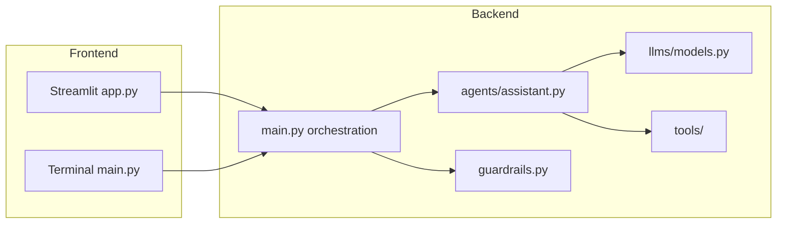

# Multi-LLM Chatbot

A Python chatbot with a **Streamlit web UI** and a **terminal CLI**. Switch between LLM providers (OpenAI, Google Gemini) through a single [LiteLLM](https://docs.litellm.ai/) integration. The assistant can use tools for math, web search, file I/O, and safe shell commands.

## Features

- **Multi-provider LLMs** — OpenAI and Gemini via LiteLLM (`langchain-litellm`)
- **Model switching** — pick a provider in the sidebar (web) or with `/openai` / `/gemini` (CLI)
- **LangChain agent** — tool-calling assistant with shared tools across providers
- **Tools** — calculator, DuckDuckGo search, read/write/list files, guarded shell commands
- **Guardrails** — basic input/output checks (length, unsafe patterns, blocked topics)
- **Chat history** — conversation context kept per session (configurable limit)
- **Optional LangSmith tracing** — observability for agent runs when configured

## Architecture



| Layer                     | Role                                                  |
| ------------------------- | ----------------------------------------------------- |
| `src/app.py`              | Streamlit chat UI (frontend)                          |
| `src/main.py`             | Request handling, history, guardrails (orchestration) |
| `src/agents/assistant.py` | LangChain agent + system prompt + tools               |
| `src/llms/models.py`      | LiteLLM model routing and caching                     |
| `src/tools/`              | Calculator, search, files, shell                      |
| `src/guardrails.py`       | Input/output safety checks                            |

## Tech stack

- Python 3.13+
- [uv](https://docs.astral.sh/uv/) for dependency management
- [Streamlit](https://streamlit.io/) — web UI
- [LangChain](https://python.langchain.com/) — agent framework
- [LiteLLM](https://docs.litellm.ai/) — unified LLM API (via `langchain-litellm`)
- [python-dotenv](https://github.com/theskumar/python-dotenv) — environment configuration

## Prerequisites

1. **Python 3.13+** — see `.python-version` in the repo
2. **[uv](https://docs.astral.sh/uv/getting-started/installation/)** (recommended) or `pip` + `venv`
3. **API keys** (at least one):
   - [OpenAI API key](https://platform.openai.com/api-keys)
   - [Google AI Studio / Gemini API key](https://aistudio.google.com/apikey)
4. **Optional:** [LangSmith](https://smith.langchain.com/) API key for tracing

## Setup

### 1. Clone the repository

```bash
git clone https://github.com/Kartikey-2004/multi-llm-chatbot.git
cd multi-llm-chatbot
```

### 2. Install dependencies

**Using uv (recommended):**

```bash
uv sync
```

This creates a virtual environment (`.venv/`) and installs packages from `pyproject.toml` / `uv.lock`.

**Using pip instead:**

```bash
python3.13 -m venv .venv
source .venv/bin/activate   # Windows: .venv\Scripts\activate
pip install -e .
```

### 3. Configure environment variables

Copy the example file and fill in your keys:

```bash
cp .env.example .env
```

Edit `.env` with your API keys. **Do not commit `.env`** — it is listed in `.gitignore`.

At minimum, set **one** of:

```env
OPENAI_API_KEY=sk-...
# and/or
GEMINI_API_KEY=...
```

Only providers with a configured key appear in the model picker.

### 4. (Optional) LangSmith tracing

To log agent runs to LangSmith, set in `.env`:

```env
LANGSMITH_API_KEY=lsv2_...
LANGSMITH_TRACING=true
LANGSMITH_PROJECT="Multi LLMs Chatbot"
```

Leave `LANGSMITH_API_KEY` empty to disable tracing.

## Environment variables

| Variable               | Required | Default             | Description                                       |
| ---------------------- | -------- | ------------------- | ------------------------------------------------- |
| `OPENAI_API_KEY`       | No\*     | —                   | OpenAI API key                                    |
| `GEMINI_API_KEY`       | No\*     | —                   | Google Gemini key (also accepts `GOOGLE_API_KEY`) |
| `LLM_PROVIDER`         | No       | `openai`            | Default provider: `openai` or `gemini`            |
| `OPENAI_MODEL`         | No       | `gpt-4o-mini`       | OpenAI model name (LiteLLM: `openai/<model>`)     |
| `GEMINI_MODEL`         | No       | `gemini-2.5-flash`  | Gemini model name (LiteLLM: `gemini/<model>`)     |
| `AGENT_FILES_DIR`      | No       | `agent_output`      | Directory for agent-created files                 |
| `MAX_HISTORY_MESSAGES` | No       | `20`                | Max messages sent as context per request          |
| `LANGSMITH_API_KEY`    | No       | —                   | LangSmith API key                                 |
| `LANGSMITH_TRACING`    | No       | `true` in example   | Enable tracing when key is set                    |
| `LANGSMITH_PROJECT`    | No       | —                   | LangSmith project name                            |
| `LANGSMITH_ENDPOINT`   | No       | LangChain cloud URL | LangSmith API endpoint                            |

\*At least one of `OPENAI_API_KEY` or `GEMINI_API_KEY` is required to run the app.

## Run

All commands assume you are in the **project root** (`multi-llm-chatbot/`).

### Web UI (Streamlit)

```bash
uv run streamlit run src/app.py
```

Then open the URL shown in the terminal (usually **[localhost:8501](http://localhost:8501)**).

**With pip/venv activated:**

```bash
streamlit run src/app.py
```

### Terminal CLI

```bash
cd src
uv run python main.py
```

Or from the project root:

```bash
uv run python src/main.py
```

(requires running from `src/` or setting `PYTHONPATH=src` so imports resolve.)

**CLI commands:**

| Input               | Action                                |
| ------------------- | ------------------------------------- |
| `quit` or `exit`    | Exit the program                      |
| `/openai <message>` | Switch to OpenAI for the next message |
| `/gemini <message>` | Switch to Gemini for the next message |
| Any other text      | Send a message to the assistant       |

Tool activity is printed to the terminal when using the CLI.

## Usage

### Switching models (web)

1. Open the sidebar (**Model** dropdown).
2. Choose **Openai** or **Gemini** (only configured providers are listed).
3. Send a message — the selected model handles the reply.
4. Each assistant message shows which provider was used.

### Switching models (CLI)

Prefix a message with `/openai` or `/gemini`, or set `LLM_PROVIDER` in `.env` for the default.

### Agent tools

The assistant may automatically use:

| Tool                                                      | Purpose                                     |
| --------------------------------------------------------- | ------------------------------------------- |
| `calculator`                                              | Math expressions                            |
| `web_search`                                              | DuckDuckGo web search                       |
| `read_file` / `write_file` / `append_file` / `list_files` | File operations under `AGENT_FILES_DIR`     |
| `run_shell_command`                                       | Shell commands (dangerous commands blocked) |

Files created by the agent are saved under `agent_output/` (or your `AGENT_FILES_DIR`). The web UI offers download buttons for generated files.

### Clear chat (web)

Use **Clear chat** in the sidebar to reset messages and the file list.

## Project structure

```text
multi-llm-chatbot/
├── .env.example          # Environment template (copy to .env)
├── .python-version       # Python version (3.13)
├── pyproject.toml        # Project metadata and dependencies
├── uv.lock               # Locked dependency versions
├── README.md
├── agent_output/         # Agent-created files (gitignored)
└── src/
    ├── app.py            # Streamlit UI
    ├── main.py           # CLI + run_assistant()
    ├── guardrails.py     # Input/output checks
    ├── agents/
    │   └── assistant.py  # LangChain agent definition
    ├── config/
    │   └── settings.py   # Settings from environment
    ├── llms/
    │   └── models.py     # LiteLLM provider routing
    └── tools/
        ├── calculator_tool.py
        ├── file_tool.py
        ├── search_tool.py
        └── shell_tool.py
```

## Troubleshooting

### “Add OPENAI_API_KEY and/or GEMINI_API_KEY to .env”

- Create `.env` from `.env.example` and add at least one valid API key.
- Restart Streamlit or the CLI after changing `.env`.

### No models in the dropdown

- Only providers with keys in `.env` are shown.
- Check for typos (`GEMINI_API_KEY`, not `GEMINI_KEY`).
- Ensure there are no extra spaces or quotes around keys.

### Rate limit / API errors

- The app surfaces a short message for HTTP 429 / quota errors.
- Wait and retry, or switch to the other provider if configured.

### Import errors when running scripts

- Run Streamlit from the **project root**: `streamlit run src/app.py`
- For `main.py`, run from `src/` or set `PYTHONPATH=src`.

### `uv run streamlit` fails after moving or renaming the project folder

- Console scripts in `.venv/bin/` embed the old absolute path in their shebang.
- Fix: remove the virtualenv and reinstall: `rm -rf .venv && uv sync`

### `VIRTUAL_ENV=.../Chat_bot/.venv` warning from `uv run`

- Your shell still has the old project’s venv activated.
- Run `deactivate`, then `source .venv/bin/activate` inside `multi-llm-chatbot`, or open a fresh terminal in this folder.

### LiteLLM warnings about `botocore`

- Harmless if you are not using AWS Bedrock. You can ignore them.

### Shell tool blocked a command

- Commands like `rm -rf`, `shutdown`, and similar patterns are blocked by design in `shell_tool.py` and `guardrails.py`.

## Development

Reinstall after dependency changes:

```bash
uv sync
```

Add a new LiteLLM-backed provider by extending `src/llms/models.py` and `configured_providers()` in the same file, then wire the UI in `src/app.py`.

## License

See [LICENSE](LICENSE) in the repository root.

## Status

Active development — suitable for learning and internship demos (multi-LLM routing, agent tools, and a simple full-stack Python layout).
